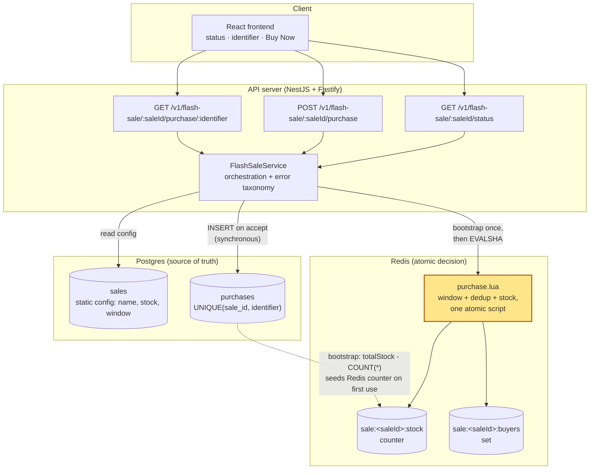
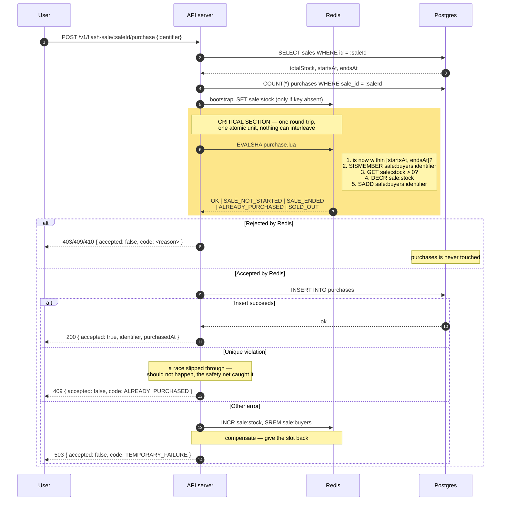

# High-Throughput Flash Sale System

A take-home implementation of a flash sale platform: one product, fixed stock, one
unit per person, no login. Users see the sale's status, enter an identifier, and
attempt to buy — the system must not oversell and must not let anyone buy twice,
even under heavy concurrent load.

Monorepo: [`app/frontend`](app/frontend) (React) and [`app/backend`](app/backend) (NestJS + Fastify API).

## Status

- Done — Frontend: all UI states implemented against a mock API (see [app/frontend/README.md](app/frontend/README.md)).
  Not yet wired to the real backend.
- Done — Backend: all three endpoints implemented and exercised end-to-end over HTTP —
  sale status, attempt purchase, and check own purchase result. See API reference below.
- Done — Backend: the atomic purchase decision (Redis Lua script + synchronous Postgres
  insert, Decision 1/2/3 below) is implemented and wired into the purchase endpoint —
  no longer target design.
- Done — Backend: sale configuration (product name, stock, window) lives in a `sales`
  table, seeded by migration with a fixed id (`default`) rather than env vars — see
  Decision 6 below.
- Done — Backend: unit tests for the sale window logic (`flash-sale.test.ts`).
- Pending — Frontend wired to the real backend (still talks to its in-memory mock).
- Pending — Integration tests against a running server + real Redis/Postgres, and the
  stress tests (oversell, duplicate-user, boundary). Manual `curl` verification has been
  done for every endpoint and error code; automated coverage is the next step.

## Quick start

```bash
npm run install:all   # installs root, backend, and frontend deps
cp app/backend/.env.example app/backend/.env
docker compose -f app/backend/build/docker/docker-compose.yml up -d db redis
npm --prefix app/backend run db:migrate   # also seeds the one `sales` row (id: "default")
npm run dev            # runs backend + frontend concurrently
```

Backend starts at `http://localhost:3000` (Swagger docs at `/docs`), frontend at
`http://localhost:5173`. The frontend still talks to its own in-memory mock API, not
the backend yet — see [app/frontend/README.md](app/frontend/README.md).

The seeded sale (`GET /v1/flash-sale/default/status`) ships with a fixed window — check
the `INSERT INTO "sales"` statement in `app/backend/src/db/migrations/0001_eminent_tag.sql`
for the exact `starts_at`/`ends_at`, and update that row directly if you need an active
window for manual testing outside of it.

To run either side alone, see [app/backend/README.md](app/backend/README.md) or
[app/frontend/README.md](app/frontend/README.md).

## Repo layout

```
app/
  frontend/   React + TypeScript + Vite. See app/frontend/README.md.
  backend/    NestJS + Fastify + TypeScript API. Boilerplate + one dummy endpoint.
              See app/backend/README.md.
```

## Architecture

The purchase decision runs as one atomic Redis Lua script (window check, per-user
dedup, stock check, and decrement — all in a single round trip), then a synchronous
Postgres insert records it durably. No message queue: at this scale (the brief says
"thousands of users", not the 100k+ QPS the standard flash-sale writeups target) a
single-row insert is not the bottleneck, and a queue would trade a rare, honest
failure mode (see below) for an eventually-consistent one that's harder to reason
about. See Key design decisions below for the full reasoning, and Known limitations
for what this trades away.

This is implemented and exercised end-to-end over HTTP (manual `curl` verification for
every endpoint and every error/status code combination). The diagrams below describe
what's actually running — one adjustment from the original target design: the sale is
identified by a `:saleId` path param (currently always `"default"`, the one seeded
sale row) rather than a single implicit global sale, since the sale's config now lives
in a database row instead of being baked into the service.

**Source of truth: Postgres.** Redis is the fast gate that decides in real time;
Postgres is the durable record Redis is reconciled against, not the other way
around. If the two ever disagree, Postgres wins, and Redis is rebuilt from it — see
Decision 2 below.

### Components



### Request path for one purchase



## Key design decisions

To be filled in as decisions are made — this section is written alongside the
code, not reconstructed afterward. So far:

- **Frontend has no backend dependency yet.** The API client
  (`app/frontend/src/api/flashSaleApi.ts`) exposes the same three functions the
  real backend will serve (sale status, attempt purchase, check user status),
  backed by an in-memory mock. This let UI work start before the backend exists,
  and means swapping in real `fetch` calls later shouldn't touch any component.
- **UI states are derived, not enumerated.** The design spec calls out nine
  distinct screens (upcoming, ready, invalid input, submitting, success, already
  purchased, sold out, ended, request failed). These aren't nine components —
  they're one `PurchaseCard` whose rendering is derived from sale status +
  submit state + failure reason. Fewer states to keep in sync by hand.
- **Backend stack: NestJS on Fastify, not Express.** Chosen for the built-in DI/module
  system (keeps the domain/application/infrastructure layering below explicit rather
  than convention-only) and Fastify's throughput advantage, relevant given the
  brief's high-throughput requirement.
- **Config is centralized in a typed `ConfigService`, never `process.env` directly.**
  One place to see every env-driven value, and a startup-time check
  (`validate-env.ts`) that fails fast if a required variable is missing instead of
  surfacing as an obscure runtime error later.

### The atomic purchase mechanism (implemented)

**Decision 1: the purchase decision happens inside one Redis Lua script.**

Chosen: a single `EVALSHA` that checks the sale window, checks per-user membership,
checks remaining stock, then decrements and records the buyer — all in one atomic
execution.

Rejected: (a) three separate reads followed by a write — the classic failure mode,
where several requests pass all checks before any of them writes; (b) `SELECT FOR
UPDATE` followed by an update, which is correct but serializes every request on one
row lock; (c) optimistic locking with retry, which turns into a retry storm exactly
when contention is highest.

Why: Redis executes a Lua script atomically, blocking all other server activity for
its duration. No interleaving is possible. This removes the entire class of race
condition structurally, not by making it merely unlikely.

**Decision 2: Postgres is the source of truth; Redis is an accelerator.**

Chosen: Postgres holds the durable record with `UNIQUE(sale_id, identifier)`. Redis
state can be fully reconstructed from Postgres (`COUNT(*)` on `purchases`, replayed
into the Redis counter and buyer set on app startup).

Rejected: Redis as the source of truth with Postgres as an archive. That would turn
losing the Redis node into losing data, not just losing performance.

Why: when the two disagree, Postgres wins, and the reconciliation direction is
one-way and unambiguous — no runtime judgment call needed during a divergence.

**Decision 3: the database write is synchronous, no message queue.**

Chosen: the `INSERT` happens in the same request, right after Redis accepts.

Rejected: a queue (Redis list or an external broker) with an async worker — the
standard pattern in most large-scale flash-sale writeups.

Why: at the scale this brief describes ("thousands of users", not the 100k+ QPS the
big write-ups target), a one-row insert is not the bottleneck. A queue would add a
real failure mode instead — Redis accepts a purchase, the message is lost before a
worker processes it, and the user holds a confirmation with no record behind it —
and it would turn "check if I secured an item" into an eventually-consistent read,
pushing the frontend toward polling for something the brief asks to keep simple.
That complexity isn't paid for at this scale. See Known limitations for where this
decision would change.

**Decision 4: idempotency is separate from per-user dedup.**

Chosen: a repeated call for the same user returns the same outcome, not an error —
a retry gets back `ALREADY_PURCHASED` referencing the same purchase.

Why: a double click is normal behavior in a flash sale, not an error condition.
Responding to a retry with failure just encourages the user to retry again, adding
load exactly when the system is under the most pressure.

**Decision 3.5: `PurchaseRepository` wraps a Drizzle client, it doesn't extend one.**

Chosen: a plain `@Injectable()` class holding an injected Drizzle client instance,
exposing `findByIdentifier`, `count`, and `insertIfNotExists` — the last one using
`.onConflictDoNothing()` against the `UNIQUE(sale_id, identifier)` index and treating
an empty result as "already purchased" rather than throwing.

Why: Drizzle has no ORM-style base `Repository` class to extend, unlike TypeORM.
Rather than build one, the repository stays a thin wrapper — consistent with the
project's general bias toward fewer abstractions than a typical company style guide
would default to.

**Decision 5: what's deliberately not built.**

Authentication, payments, multiple products, an admin interface, rate limiting,
a virtual waiting room, Redis stock sharding, horizontal deployment, an observability
stack. Each would add surface area without demonstrating anything new about this
test's actual point: concurrency control. See "What I would do differently with
more time" for which of these would be next.

**Decision 6: sale configuration lives in a `sales` table, not env vars.**

Chosen: a `sales` table (`id`, `productName`, `productDescription`, `totalStock`,
`startsAt`, `endsAt`) holding static config only — the live stock counter is not a
column here, it lives in Redis, reconciled against `purchases` (see Decision 2). One
row is seeded by migration with a fixed, well-known id (`"default"`), so the service
never needs a "find the active sale" query — every endpoint takes `:saleId` as a path
param and looks that row up directly.

Rejected: (a) env vars (`SALE_STOCK`, `SALE_START_AT`, ...) — not configurable without
a redeploy, and weaker against the brief's "configurable start and end time" wording;
(b) a live `stockRemaining` column on `sales`, updated per purchase — a second place
stock would be tracked alongside the Redis counter and the `purchases` count, needing
its own atomic update path for no benefit at this scope.

Why: a real row (even a single hardcoded one) is closer to how this would actually be
configured operationally, and it's what makes `:saleId` in the URL meaningful rather
than decorative — the endpoints look like they'd support more than one sale even
though only one row exists today.

**Decision 7: HTTP status carries meaning too, not just the `code` field.**

Chosen: `SALE_NOT_STARTED` → `403`, `SALE_ENDED` → `410`, `ALREADY_PURCHASED` → `409`,
`SOLD_OUT` → `409`, `TEMPORARY_FAILURE` → `503`, `NOT_PURCHASED` → `200`, and a
successful purchase → `200` (not the Nest/REST default `201` for `POST` — a purchase
attempt isn't reliably "resource created," most valid requests under contention
won't be).

Rejected: this project's own original plan — every expected-failure state returns
`200`, with the `code` field as the only signal, on the reasoning that HTTP status
alone shouldn't carry state (and shouldn't be relied on *alone*, in isolation — see
below). That's still true in isolation, but it under-uses HTTP: a `409` on
`ALREADY_PURCHASED` costs the frontend nothing (it was already branching on `code`),
and it means a reviewer curling the API without reading the body gets a meaningful
signal for free.

Why this isn't a contradiction: the two axes serve different consumers. HTTP status
answers "what broad category is this" (client error vs. conflict vs. gone vs. server
trouble) for anything sitting between the client and the handler — proxies, curl,
browser devtools, API gateways. The `code` field answers "which specific one, and
what do I show the user" for the frontend. Neither alone is sufficient — `409` alone
can't distinguish `ALREADY_PURCHASED` from `SOLD_OUT`, and `code` alone throws away
information that's free to carry on the status line. `429 Too Many Requests` was
considered and rejected for `ALREADY_PURCHASED`: that status means "you're sending
requests too fast, retry later," which is a rate/throttling signal, not a domain
conflict — retrying an `ALREADY_PURCHASED` response is never going to succeed, unlike
a genuine `429`.

## API reference

All three endpoints from the brief are implemented. Swagger docs (with request/response
schemas) are served at `/docs` once the backend is running. `:saleId` is currently
always `"default"` — the one seeded row (see Decision 6 above).

| Endpoint | Purpose |
|---|---|
| `GET /v1/flash-sale/:saleId/status` | Sale status (upcoming/active/ended), stock remaining |
| `POST /v1/flash-sale/:saleId/purchase` | Attempt a purchase — body: `{ "identifier": string }` |
| `GET /v1/flash-sale/:saleId/purchase/:identifier` | Check whether this identifier has secured an item |

**`GET .../status`** response:

```json
{
  "status": "active",
  "productName": "Messi Argentina 2026 Special Edition Jersey",
  "productDescription": "Limited commemorative run. Never restocked. One unit per person, while stock lasts.",
  "startsAt": "2026-09-10T00:00:00.000Z",
  "endsAt": "2026-09-10T23:59:59.000Z",
  "stockRemaining": 98,
  "totalStock": 100
}
```

**`POST .../purchase`** and **`GET .../purchase/:identifier`** both return the same
shape — a discriminated union on `accepted`:

```json
// success
{ "accepted": true, "identifier": "user@example.com", "purchasedAt": "2026-09-10T00:01:12.000Z" }

// failure
{ "accepted": false, "code": "ALREADY_PURCHASED", "message": "You have already purchased this item." }
```

Error taxonomy — every failure carries a machine-readable `code`, and the HTTP status
is meaningful too (see Decision 7 above for why both):

| `code` | HTTP status | When |
|---|---|---|
| `SALE_NOT_STARTED` | 403 | Purchase attempted before `startsAt` |
| `SALE_ENDED` | 410 | Purchase attempted after `endsAt` |
| `ALREADY_PURCHASED` | 409 | This identifier already holds a purchase for this sale |
| `SOLD_OUT` | 409 | Stock exhausted while the sale is still open |
| `NOT_PURCHASED` | 200 | (`GET .../purchase/:identifier` only) this identifier hasn't purchased — not an error, the check itself succeeded |
| `TEMPORARY_FAILURE` | 503 | Redis accepted the purchase but the Postgres write failed unexpectedly; the Redis slot is given back (compensated) before responding |

All of the above were verified manually end-to-end (`curl`, with the sale window and
seed row adjusted to force each state) — see Testing below for what's automated
versus manual so far.

## Testing

- **Unit (automated):** `flash-sale.test.ts` covers the sale window boundary logic
  (`resolveWindowStatus`) — before `startsAt`, exactly at `startsAt`, exactly at
  `endsAt`, and just after `endsAt`. Run with `npm run test:backend` (or
  `npm --prefix app/backend run test`).
- **Endpoint behavior (manual so far):** every endpoint and every error/status code
  combination in the API reference table above has been exercised via `curl` against
  the real running server, real Redis, and real Postgres — including forcing
  `SALE_NOT_STARTED`, `SALE_ENDED`, `ALREADY_PURCHASED`, and `NOT_PURCHASED` by
  adjusting the seeded sale's window, and confirming the idempotency guarantee
  (Decision 4): a second purchase call for the same identifier returns
  `ALREADY_PURCHASED`, not a duplicate success or a generic error.
- **Integration (automated) — pending:** the manual verification above needs to become
  a real test suite that hits the running server over HTTP against real Redis/Postgres
  (mocking Redis here would defeat the point of testing the concurrency mechanism).
- **Stress tests — pending:** the oversell test (stock `S`, `N ≫ S` concurrent
  requests from distinct users, assert exactly `S` succeeded and stock never goes
  negative), the duplicate-user test (one user, many concurrent requests, exactly one
  success), and boundary tests, run repeatedly since race conditions are probabilistic.
- Frontend: no test runner installed yet, and not yet wired to the real backend.

## Stress test results

Not yet run. What to expect once they are, and why: the atomic decision (Decision 1)
means the oversell test's invariant — exactly `S` successes out of `N ≫ S` concurrent
requests, remaining stock exactly `0`, never negative — should hold regardless of `N`,
because Redis serializes the Lua script execution; the expected bottleneck under load
is Redis single-threaded throughput on that one key, not a race condition slipping
through. If a run ever shows more than `S` successes, that's evidence the atomicity
assumption is broken, not evidence of "bad luck" — which is why the plan is to run it
at least ten times, not once.

## Known limitations

- **The frontend is not wired to the real backend yet** — it's still fully built
  against its own in-memory mock (`app/frontend/src/api/flashSaleApi.ts`).
- **The Redis decrement and the Postgres insert are not atomic with each other.**
  If the process dies between the two, one unit of stock is lost — the system
  undersells, it does not oversell. This is a deliberate trade-off, not an oversight:
  overselling is a customer-facing failure (promising an item that doesn't exist);
  underselling one unit out of a hundred is an internal loss that can be
  reconciled later. Closing this gap would require a reservation with a TTL and a
  confirm/rollback state machine — complexity that isn't justified at this scale.
- No authentication — a plain identifier (email/username) is trusted as-is, per
  the brief's simplification.
- **Automated integration and stress tests don't exist yet** — only the sale-window
  unit test is automated. Every endpoint has been verified manually against the real
  stack, but "verified manually once" is exactly the trap section 4.1 of the working
  notes warns about — a single passing run proves little for a concurrency-critical
  path. Writing the automated oversell/duplicate-user/boundary tests is the next
  priority, not an afterthought.
- **Path aliasing (`src/...` absolute imports) needed extra wiring beyond `tsconfig.json`
  alone.** TypeScript's `paths` only affects compile-time resolution, not runtime — so
  `ts-jest` needed a matching `moduleNameMapper`, and `nest build`'s output needed
  `tsc-alias` run after it to rewrite the aliases back to relative paths for
  `node dist/main.js` to work outside of `ts-node`/`nest start`. Worth knowing if this
  pattern gets copied into a project that isn't running everything through Nest's own
  dev server.
- The dev container's `nest start --watch` shells out to `ps` on file-change restarts,
  which isn't present in the base image — logs a non-fatal `spawn ps ENOENT` on every
  hot reload. Doesn't affect correctness (Nest still restarts successfully); would be
  fixed by installing `procps` in the dev stage if the noise became a problem.

## What I would do differently with more time

- **A message queue in front of the Postgres write**, once insert throughput (not
  Redis) is the measured bottleneck — decouples user-facing latency from the write,
  at the cost of an eventually-consistent "check my purchase" endpoint.
- **A virtual waiting room** (Redis sorted set admission control) if traffic were an
  order of magnitude higher than "thousands of users" — solves an admission problem
  this brief's scale doesn't have.
- **Stock sharding across Redis nodes** to avoid a hot key, relevant only past a
  single Redis instance's ceiling.
- **Rate limiting and bot gating** — a large share of flash-sale traffic in the wild
  is automated; not modeled here.
- **A reservation-with-TTL state machine** to close the undersell gap noted above,
  if losing even one unit of stock became unacceptable.
