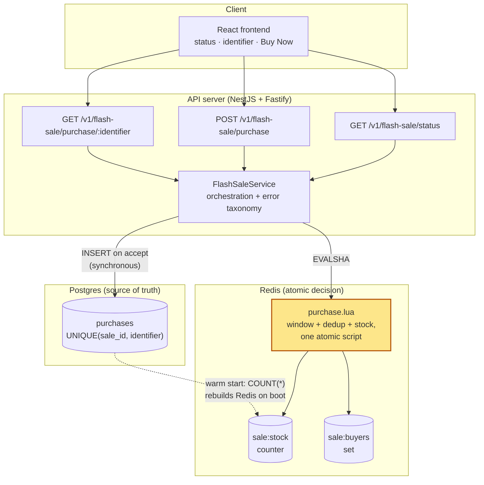
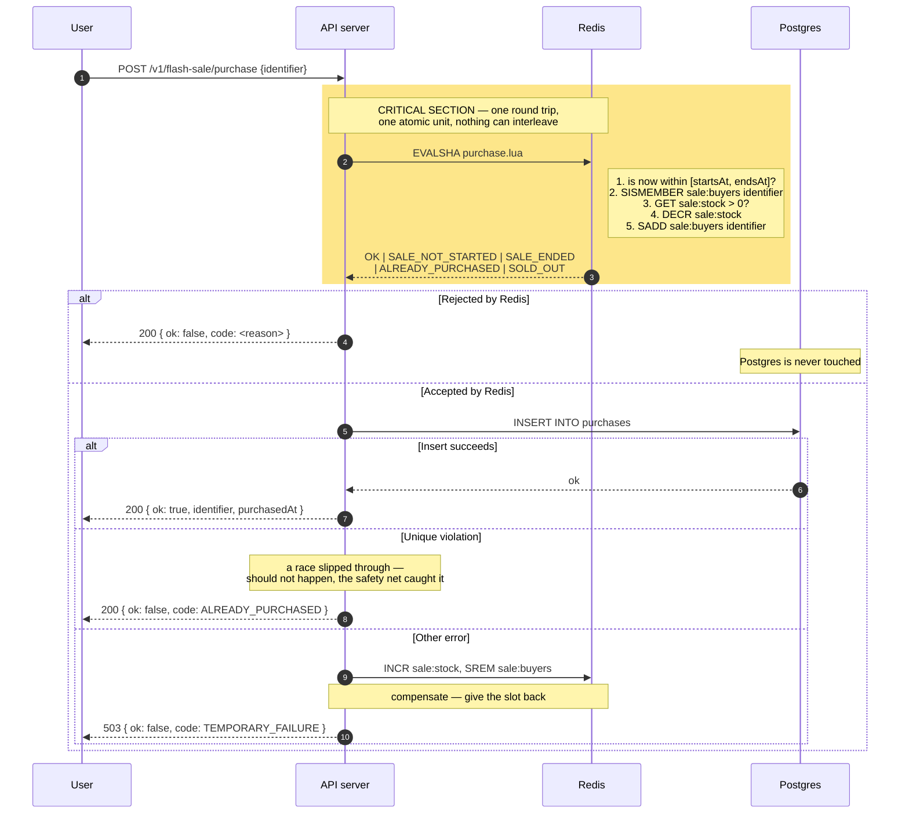

# High-Throughput Flash Sale System

A take-home implementation of a flash sale platform: one product, fixed stock, one
unit per person, no login. Users see the sale's status, enter an identifier, and
attempt to buy — the system must not oversell and must not let anyone buy twice,
even under heavy concurrent load.

Monorepo: [`app/frontend`](app/frontend) (React) and [`app/backend`](app/backend) (NestJS + Fastify API).

## Status

- Done — Frontend: all UI states implemented against a mock API (see [app/frontend/README.md](app/frontend/README.md)).
- Done — Backend: boilerplate set up (NestJS + Fastify, config loading, Swagger docs) with
  one dummy endpoint (`GET /v1/flash-sale/status`, hardcoded response). See
  [app/backend/README.md](app/backend/README.md).
- Done — Backend: persistence layer wired (Drizzle + Postgres, `purchases` table migrated,
  `PurchaseRepository` implemented; Redis provisioned via docker-compose, not yet used
  in code). Not yet called by any endpoint.
- Pending — Backend: the atomic purchase decision, the other two endpoints, and the frontend
  actually talking to it.
- Pending — Stress tests, unit/integration tests: waiting on the real backend logic.

## Quick start

```bash
npm run install:all   # installs root, backend, and frontend deps
cp app/backend/.env.example app/backend/.env
docker compose -f app/backend/build/docker/docker-compose.yml up -d db redis
npm --prefix app/backend run db:migrate
npm run dev            # runs backend + frontend concurrently
```

Backend starts at `http://localhost:3000` (Swagger docs at `/docs`), frontend at
`http://localhost:5173`. The frontend still talks to its own in-memory mock API, not
the backend yet — see [app/frontend/README.md](app/frontend/README.md).

To run either side alone, see [app/backend/README.md](app/backend/README.md) or
[app/frontend/README.md](app/frontend/README.md).

## Repo layout

```
app/
  frontend/   React + TypeScript + Vite. See app/frontend/README.md.
  backend/    NestJS + Fastify + TypeScript API. Boilerplate + one dummy endpoint.
              See app/backend/README.md.
```

## Architecture

The purchase decision runs as one atomic Redis Lua script (window check, per-user
dedup, stock check, and decrement — all in a single round trip), then a synchronous
Postgres insert records it durably. No message queue: at this scale (the brief says
"thousands of users", not the 100k+ QPS the standard flash-sale writeups target) a
single-row insert is not the bottleneck, and a queue would trade a rare, honest
failure mode (see below) for an eventually-consistent one that's harder to reason
about. See Key design decisions below for the full reasoning, and Known limitations
for what this trades away.

This is not yet implemented — the backend is boilerplate plus one dummy endpoint.
The diagrams below describe the target design.

**Source of truth: Postgres.** Redis is the fast gate that decides in real time;
Postgres is the durable record Redis is reconciled against, not the other way
around. If the two ever disagree, Postgres wins, and Redis is rebuilt from it — see
Decision 2 below.

### Components



### Request path for one purchase



## Key design decisions

To be filled in as decisions are made — this section is written alongside the
code, not reconstructed afterward. So far:

- **Frontend has no backend dependency yet.** The API client
  (`app/frontend/src/api/flashSaleApi.ts`) exposes the same three functions the
  real backend will serve (sale status, attempt purchase, check user status),
  backed by an in-memory mock. This let UI work start before the backend exists,
  and means swapping in real `fetch` calls later shouldn't touch any component.
- **UI states are derived, not enumerated.** The design spec calls out nine
  distinct screens (upcoming, ready, invalid input, submitting, success, already
  purchased, sold out, ended, request failed). These aren't nine components —
  they're one `PurchaseCard` whose rendering is derived from sale status +
  submit state + failure reason. Fewer states to keep in sync by hand.
- **Backend stack: NestJS on Fastify, not Express.** Chosen for the built-in DI/module
  system (keeps the domain/application/infrastructure layering below explicit rather
  than convention-only) and Fastify's throughput advantage, relevant given the
  brief's high-throughput requirement.
- **Config is centralized in a typed `ConfigService`, never `process.env` directly.**
  One place to see every env-driven value, and a startup-time check
  (`validate-env.ts`) that fails fast if a required variable is missing instead of
  surfacing as an obscure runtime error later.

### The atomic purchase mechanism (not yet implemented — target design)

**Decision 1: the purchase decision happens inside one Redis Lua script.**

Chosen: a single `EVALSHA` that checks the sale window, checks per-user membership,
checks remaining stock, then decrements and records the buyer — all in one atomic
execution.

Rejected: (a) three separate reads followed by a write — the classic failure mode,
where several requests pass all checks before any of them writes; (b) `SELECT FOR
UPDATE` followed by an update, which is correct but serializes every request on one
row lock; (c) optimistic locking with retry, which turns into a retry storm exactly
when contention is highest.

Why: Redis executes a Lua script atomically, blocking all other server activity for
its duration. No interleaving is possible. This removes the entire class of race
condition structurally, not by making it merely unlikely.

**Decision 2: Postgres is the source of truth; Redis is an accelerator.**

Chosen: Postgres holds the durable record with `UNIQUE(sale_id, identifier)`. Redis
state can be fully reconstructed from Postgres (`COUNT(*)` on `purchases`, replayed
into the Redis counter and buyer set on app startup).

Rejected: Redis as the source of truth with Postgres as an archive. That would turn
losing the Redis node into losing data, not just losing performance.

Why: when the two disagree, Postgres wins, and the reconciliation direction is
one-way and unambiguous — no runtime judgment call needed during a divergence.

**Decision 3: the database write is synchronous, no message queue.**

Chosen: the `INSERT` happens in the same request, right after Redis accepts.

Rejected: a queue (Redis list or an external broker) with an async worker — the
standard pattern in most large-scale flash-sale writeups.

Why: at the scale this brief describes ("thousands of users", not the 100k+ QPS the
big write-ups target), a one-row insert is not the bottleneck. A queue would add a
real failure mode instead — Redis accepts a purchase, the message is lost before a
worker processes it, and the user holds a confirmation with no record behind it —
and it would turn "check if I secured an item" into an eventually-consistent read,
pushing the frontend toward polling for something the brief asks to keep simple.
That complexity isn't paid for at this scale. See Known limitations for where this
decision would change.

**Decision 4: idempotency is separate from per-user dedup.**

Chosen: a repeated call for the same user returns the same outcome, not an error —
a retry gets back `ALREADY_PURCHASED` referencing the same purchase.

Why: a double click is normal behavior in a flash sale, not an error condition.
Responding to a retry with failure just encourages the user to retry again, adding
load exactly when the system is under the most pressure.

**Decision 3.5: `PurchaseRepository` wraps a Drizzle client, it doesn't extend one.**

Chosen: a plain `@Injectable()` class holding an injected Drizzle client instance,
exposing `findByIdentifier`, `count`, and `insertIfNotExists` — the last one using
`.onConflictDoNothing()` against the `UNIQUE(sale_id, identifier)` index and treating
an empty result as "already purchased" rather than throwing.

Why: Drizzle has no ORM-style base `Repository` class to extend, unlike TypeORM.
Rather than build one, the repository stays a thin wrapper — consistent with the
project's general bias toward fewer abstractions than a typical company style guide
would default to.

**Decision 5: what's deliberately not built.**

Authentication, payments, multiple products, an admin interface, rate limiting,
a virtual waiting room, Redis stock sharding, horizontal deployment, an observability
stack. Each would add surface area without demonstrating anything new about this
test's actual point: concurrency control. See "What I would do differently with
more time" for which of these would be next.

## API reference

Only one endpoint exists so far, and its response is a hardcoded dummy — see
[app/backend/README.md](app/backend/README.md#api-reference) for the current shape.

Planned per the brief:

| Endpoint | Purpose | Status |
|---|---|---|
| `GET /v1/flash-sale/status` | Sale status (upcoming/active/ended) | Done — dummy response |
| `POST /v1/flash-sale/purchase` | Attempt a purchase | Pending |
| `GET /v1/flash-sale/purchase/:identifier` | Check own purchase result | Pending |

Error taxonomy (machine-readable codes, not HTTP status alone) is not implemented
yet — will be documented here once the purchase endpoint exists.

## Testing

- Backend: Jest is wired (`.test.ts` suffix) but no tests exist yet — `npm run test:backend` passes with 0 tests found.
- Frontend: no test runner installed yet.
- Integration/stress tests: pending the real backend logic.

## Stress test results

Not yet applicable — pending the backend's concurrency control implementation.

## Known limitations

- Backend has no real purchase logic, persistence, or the other two endpoints yet —
  only boilerplate and one dummy endpoint. The frontend is still fully built against
  its own mock and has not been exercised against the real server.
- **The Redis decrement and the Postgres insert are not atomic with each other.**
  If the process dies between the two, one unit of stock is lost — the system
  undersells, it does not oversell. This is a deliberate trade-off, not an oversight:
  overselling is a customer-facing failure (promising an item that doesn't exist);
  underselling one unit out of a hundred is an internal loss that can be
  reconciled later. Closing this gap would require a reservation with a TTL and a
  confirm/rollback state machine — complexity that isn't justified at this scale.
- No authentication — a plain identifier (email/username) is trusted as-is, per
  the brief's simplification.
- No automated tests yet on either side.

## What I would do differently with more time

- **A message queue in front of the Postgres write**, once insert throughput (not
  Redis) is the measured bottleneck — decouples user-facing latency from the write,
  at the cost of an eventually-consistent "check my purchase" endpoint.
- **A virtual waiting room** (Redis sorted set admission control) if traffic were an
  order of magnitude higher than "thousands of users" — solves an admission problem
  this brief's scale doesn't have.
- **Stock sharding across Redis nodes** to avoid a hot key, relevant only past a
  single Redis instance's ceiling.
- **Rate limiting and bot gating** — a large share of flash-sale traffic in the wild
  is automated; not modeled here.
- **A reservation-with-TTL state machine** to close the undersell gap noted above,
  if losing even one unit of stock became unacceptable.
