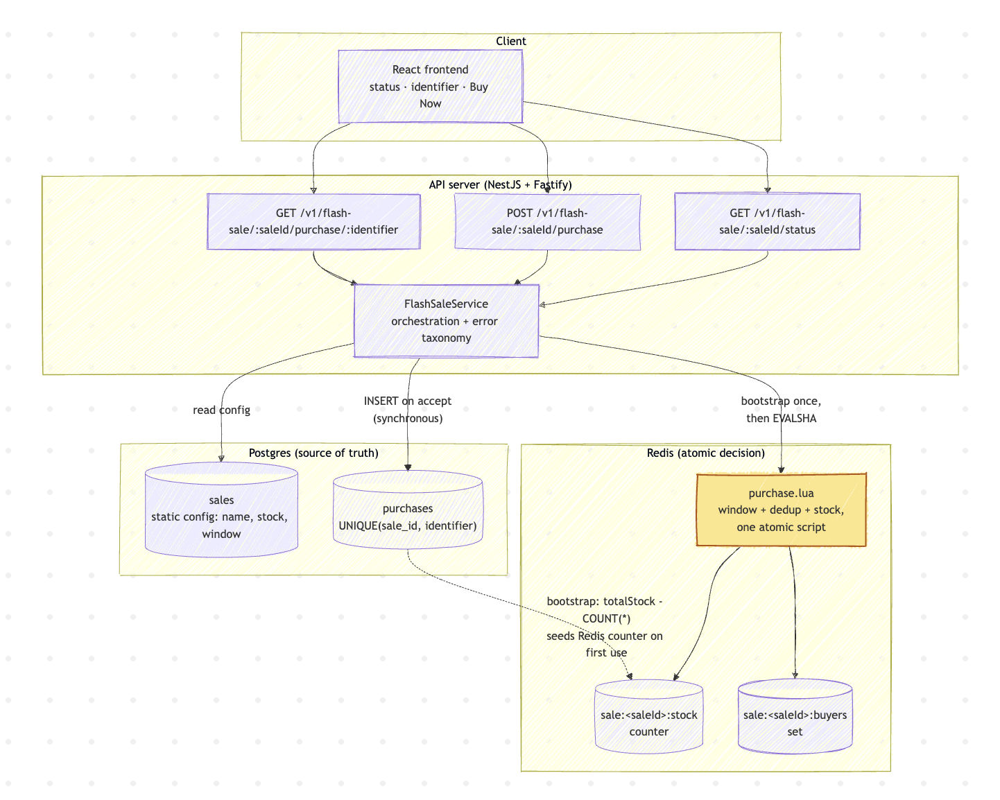
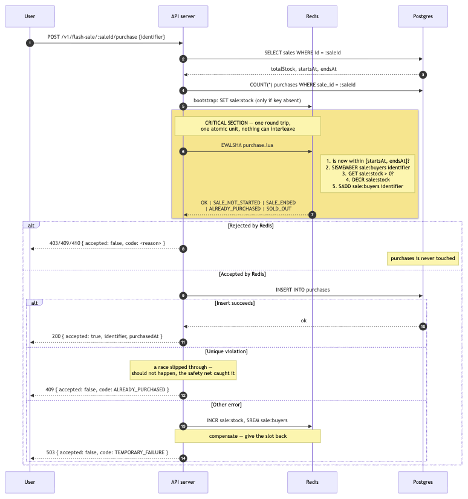

# High-Throughput Flash Sale System

A take-home implementation of a flash sale platform: one product, fixed stock, one
unit per person, no login. Users see the sale's status, enter an identifier, and
attempt to buy — the system must not oversell and must not let anyone buy twice,
even under heavy concurrent load.

Monorepo: [`app/frontend`](app/frontend) (React) and [`app/backend`](app/backend) (NestJS + Fastify API).

## Status

- Done — Backend: all three endpoints implemented and exercised end-to-end over HTTP —
  sale status, attempt purchase, and check own purchase result. See API reference below.
- Done — Backend: the atomic purchase decision (Redis Lua script + synchronous Postgres
  insert, Decision 1/2/3 below) is implemented and wired into the purchase endpoint —
  no longer target design.
- Done — Backend: sale configuration (product name, stock, window) lives in a `sales`
  table, seeded by migration with a fixed id (`default`) rather than env vars — see
  Decision 6 below.
- Done — Backend: unit tests for `FlashSaleService` (`flash-sale.test.ts`) — sale
  window boundaries plus `attemptPurchase`/`getSaleStatus`/`checkPurchaseStatus` with
  `SaleRepository`/`PurchaseRepository`/`PurchaseGateway` mocked via `jest.fn()`.
- Done — Backend: automated integration tests (`flash-sale.integration.test.ts`) hitting
  a real running Nest app over HTTP, against real Postgres and real Redis — every error
  taxonomy code, the oversell invariant, and the duplicate-user invariant. See Testing
  below.
- Done — Frontend wired to the real backend over HTTP (axios). See
  [app/frontend/README.md](app/frontend/README.md) for the client layer.
- Done — Production frontend image supports runtime env injection (`window.__ENV__`,
  substituted into `env-config.js` by the container's entrypoint at startup) so the
  same built image can point at different backend URLs without a rebuild. Every
  frontend call site reads env through `lib/config.ts`, so this actually takes
  effect end-to-end, not just at the config-layer level.
- Done — Stress tests at high concurrency (`npm run test:stress` in `app/backend`):
  10 iterations of stock=50/10,000-concurrent-user oversell, one duplicate-user run,
  and one boundary run, all against the real running server. See Stress test results
  below.

## Quick start

Installs root, backend, and frontend deps:
```bash
npm run install:all
```

Prepares the backend env file:
```bash
cp app/backend/.env.example app/backend/.env
```

Prepares the frontend env file:
```bash
cp app/frontend/.env.example app/frontend/.env
```

Starts Postgres and Redis in Docker:
```bash
docker compose -f app/backend/build/docker/docker-compose.yml up -d db redis
```

Applies migrations (also seeds the one `sales` row, id `"default"`):
```bash
npm --prefix app/backend run db:migrate
```

Runs backend and frontend concurrently:
```bash
npm run dev
```

Backend starts at `http://localhost:3000` (Swagger docs at `/docs`), frontend at
`http://localhost:5173` and talks to the real backend over HTTP — see
[app/frontend/README.md](app/frontend/README.md) for the client layer.

The seeded sale (`GET /v1/flash-sale/default/status`) comes up **active**: migration
`0002_fresh_sale_window.sql` anchors the `default` row's window relative to when you run
`db:migrate` (`now() - 1 hour` → `now() + 23 hours`), so a fresh clone can purchase
immediately rather than landing on an already-closed window. It only re-anchors a window
that has already ended, so a window you set yourself for manual testing is left alone —
re-run `npm --prefix app/backend run db:migrate` to roll it forward again once it lapses.

To run either side alone, see [app/backend/README.md](app/backend/README.md) or
[app/frontend/README.md](app/frontend/README.md).

## Build

Builds backend then frontend:
```bash
npm run build
```

Builds just the backend (`nest build && tsc-alias` — path aliases rewritten for `node dist/main.js`):
```bash
npm run build:backend
```

Builds just the frontend (`tsc -b && vite build`):
```bash
npm run build:frontend
```

Backend output: `app/backend/dist/main.js`, runnable directly with `node dist/main.js`
once `app/backend/dist/node_modules` — actually just `app/backend`'s own
`node_modules` (production deps only, see `npm install --omit=dev` in the Docker
`runner` stage below) — is in place and `.env` is present. Frontend output:
`app/frontend/dist/`, a static bundle servable by any static file server (the
production Docker image serves it via nginx — see below).

## Running with Docker

Two independent app/backend and app/frontend Docker setups under `build/docker/`.
The backend's `docker-compose.yml` defines the shared services (db, redis, pgadmin) and
builds the backend's production `runner` stage; `docker-compose.override.yml` is what
makes it a dev stack (the `base` stage, source bind-mounted, `nest start --watch`), and
`docker-compose.production.yml` is the standalone prod stack. The frontend has a
`docker-compose.yml` (Vite dev server) and a `docker-compose.production.yml` (nginx).

Every `docker:up*` script passes `--build`, so images are rebuilt from the current
source rather than silently reusing a stale one — the prod compose files pin fixed
image tags (`bookipi-flash-sale-backend:latest`), which Docker would otherwise reuse
as-is even after the code changed. The root `package.json` wraps both sides into single
`docker:up*` commands; see [app/backend/README.md](app/backend/README.md#running) and
[app/frontend/README.md](app/frontend/README.md#running) if you want to run one
side's Docker setup on its own.

**Dev** — backend (hot-reload, source mounted from the host) + frontend (Vite dev
server, HMR) + Postgres + Redis + pgAdmin, all in containers:

Prepares the backend env file:
```bash
cp app/backend/.env.example app/backend/.env
```

Prepares the frontend env file:
```bash
cp app/frontend/.env.example app/frontend/.env
```

Starts the backend stack (db, redis, pgadmin, backend w/ `--watch`) and the frontend (Vite):
```bash
npm run docker:up
```

Applies migrations, from the host — `drizzle-kit` isn't in the containers' runtime image:
```bash
npm --prefix app/backend run db:migrate
```

Backend at `http://localhost:3000`, frontend at `http://localhost:5173`, pgAdmin at
`http://localhost:5050`. Stop with `npm run docker:down`; tail logs with
`npm run docker:logs`.

`docker:down` tears the backend stack down with `-v`. That removes only the **anonymous
volume masking the dev container's `node_modules`** — Postgres, Redis, and pgAdmin data
live in host bind mounts under `build/docker/volumes/`, so nothing durable is lost. This
matters: that anonymous volume outlives a plain `down`, and because it shadows the
image's own `node_modules`, a container rebuilt with new dependencies would keep booting
against the old ones and fail at compile time with `TS2307: Cannot find module 'ioredis'`
(or `class-validator`, `supertest`) while still reporting its status as `Up`. Dropping it
on the way down keeps the next `docker:up` honest.

**Prod** — built images only (backend: compiled `dist/`, prod deps; frontend:
static `dist/` served by nginx with runtime env injection — `VITE_FLASH_SALE_API_BASE_URL`
and `VITE_FLASH_SALE_DEFAULT_SALE_ID` are substituted into `env-config.js` by the
container's entrypoint at startup, so one built image can be repointed without a rebuild):

Starts both stacks from their production images:
```bash
npm run docker:up:prod
```

Applies migrations, from the host (see caveat below):
```bash
npm --prefix app/backend run db:migrate
```

Backend at `http://localhost:3000`, frontend at `http://localhost:5173` (nginx,
mapped from container port 80 — see `FRONTEND_PORT` in
`app/frontend/build/docker/docker-compose.production.yml`). Stop with
`npm run docker:down:prod`; tail logs with `npm run docker:logs:prod`.

**Migrations are not run automatically by either compose file, dev or prod** —
there's no migration step in the Dockerfiles or a compose `command` override, and
`drizzle-kit` is a devDependency, deliberately excluded from the backend's `runner`
image (`npm install --omit=dev`) to keep the production image lean. Run
`npm --prefix app/backend run db:migrate` from the host after `db` is up and
healthy — this works against both dev and prod compose stacks because Postgres's
port is published to the host in both (`DB_PORT`, default `5432`).

## Repo layout

```
app/
  frontend/   React + TypeScript + Vite, wired to the real backend over HTTP.
              See app/frontend/README.md.
  backend/    NestJS + Fastify + TypeScript API — all three endpoints, atomic
              purchase decision, unit + integration tests. See app/backend/README.md.
```

## Architecture

The purchase decision runs as one atomic Redis Lua script (window check, per-user
dedup, stock check, and decrement — all in a single round trip), then a synchronous
Postgres insert records it durably. No message queue: at this scale (the brief says
"thousands of users", not the 100k+ QPS the standard flash-sale writeups target) a
single-row insert is not the bottleneck, and a queue would trade a rare, honest
failure mode (see below) for an eventually-consistent one that's harder to reason
about. See Key design decisions below for the full reasoning, and Known limitations
for what this trades away.

This is implemented and exercised end-to-end over HTTP (manual `curl` verification for
every endpoint and every error/status code combination). The diagrams below describe
what's actually running — one adjustment from the original target design: the sale is
identified by a `:saleId` path param (currently always `"default"`, the one seeded
sale row) rather than a single implicit global sale, since the sale's config now lives
in a database row instead of being baked into the service.

**Source of truth: Postgres.** Redis is the fast gate that decides in real time;
Postgres is the durable record Redis is reconciled against, not the other way
around. If the two ever disagree, Postgres wins, and Redis is rebuilt from it — see
Decision 2 below.

### Components



### Request path for one purchase



## Key design decisions

To be filled in as decisions are made — this section is written alongside the
code, not reconstructed afterward. So far:

- **Frontend was built against an in-memory mock before the backend existed, by
  design.** The API client exposed the same three functions the real backend
  would serve (sale status, attempt purchase, check user status), so UI work
  could start immediately without waiting on the backend. This paid off as
  intended: swapping the mock for real axios calls against the running backend
  (`app/frontend/src/api/flash-sale/`) touched only the API layer — no component
  or hook needed to change, since they were already built against the same
  function signatures and the same discriminated-union result shape.
- **UI states are derived, not enumerated.** The design spec calls out nine
  distinct screens (upcoming, ready, invalid input, submitting, success, already
  purchased, sold out, ended, request failed). These aren't nine components —
  they're one `PurchaseCard` whose rendering is derived from sale status +
  submit state + failure reason. Fewer states to keep in sync by hand.
- **Backend stack: NestJS on Fastify, not Express.** Chosen for the built-in DI/module
  system (keeps the domain/application/infrastructure layering below explicit rather
  than convention-only) and Fastify's throughput advantage, relevant given the
  brief's high-throughput requirement.
- **Config is centralized in a typed `ConfigService`, never `process.env` directly.**
  One place to see every env-driven value, and a startup-time check
  (`validate-env.ts`) that fails fast if a required variable is missing instead of
  surfacing as an obscure runtime error later.

### The atomic purchase mechanism (implemented)

**Decision 1: the purchase decision happens inside one Redis Lua script.**

Chosen: a single `EVALSHA` that checks the sale window, checks per-user membership,
checks remaining stock, then decrements and records the buyer — all in one atomic
execution.

Rejected: (a) three separate reads followed by a write — the classic failure mode,
where several requests pass all checks before any of them writes; (b) `SELECT FOR
UPDATE` followed by an update, which is correct but serializes every request on one
row lock; (c) optimistic locking with retry, which turns into a retry storm exactly
when contention is highest.

Why: Redis executes a Lua script atomically, blocking all other server activity for
its duration. No interleaving is possible. This removes the entire class of race
condition structurally, not by making it merely unlikely.

**Decision 2: Postgres is the source of truth; Redis is an accelerator.**

Chosen: Postgres holds the durable record with `UNIQUE(sale_id, identifier)`. Redis
state can be fully reconstructed from Postgres (`COUNT(*)` on `purchases`, replayed
into the Redis counter and buyer set on app startup).

Rejected: Redis as the source of truth with Postgres as an archive. That would turn
losing the Redis node into losing data, not just losing performance.

Why: when the two disagree, Postgres wins, and the reconciliation direction is
one-way and unambiguous — no runtime judgment call needed during a divergence.

**Decision 3: the database write is synchronous, no message queue.**

Chosen: the `INSERT` happens in the same request, right after Redis accepts.

Rejected: a queue (Redis list or an external broker) with an async worker — the
standard pattern in most large-scale flash-sale writeups.

Why: at the scale this brief describes ("thousands of users", not the 100k+ QPS the
big write-ups target), a one-row insert is not the bottleneck. A queue would add a
real failure mode instead — Redis accepts a purchase, the message is lost before a
worker processes it, and the user holds a confirmation with no record behind it —
and it would turn "check if I secured an item" into an eventually-consistent read,
pushing the frontend toward polling for something the brief asks to keep simple.
That complexity isn't paid for at this scale. See Known limitations for where this
decision would change.

**Decision 4: idempotency is separate from per-user dedup.**

Chosen: a repeated call for the same user returns the same outcome, not an error —
a retry gets back `ALREADY_PURCHASED` referencing the same purchase.

Why: a double click is normal behavior in a flash sale, not an error condition.
Responding to a retry with failure just encourages the user to retry again, adding
load exactly when the system is under the most pressure.

**Decision 3.5: `PurchaseRepository` wraps a Drizzle client, it doesn't extend one.**

Chosen: a plain `@Injectable()` class holding an injected Drizzle client instance,
exposing `findByIdentifier`, `count`, and `insertIfNotExists` — the last one using
`.onConflictDoNothing()` against the `UNIQUE(sale_id, identifier)` index and treating
an empty result as "already purchased" rather than throwing.

Why: Drizzle has no ORM-style base `Repository` class to extend, unlike TypeORM.
Rather than build one, the repository stays a thin wrapper — consistent with the
project's general bias toward fewer abstractions than a typical company style guide
would default to.

**Decision 5: what's deliberately not built.**

Authentication, payments, multiple products, an admin interface, rate limiting,
a virtual waiting room, Redis stock sharding, horizontal deployment, an observability
stack. Each would add surface area without demonstrating anything new about this
test's actual point: concurrency control. See "What I would do differently with
more time" for which of these would be next.

**Decision 6: sale configuration lives in a `sales` table, not env vars.**

Chosen: a `sales` table (`id`, `productName`, `productDescription`, `totalStock`,
`startsAt`, `endsAt`) holding static config only — the live stock counter is not a
column here, it lives in Redis, reconciled against `purchases` (see Decision 2). One
row is seeded by migration with a fixed, well-known id (`"default"`), so the service
never needs a "find the active sale" query — every endpoint takes `:saleId` as a path
param and looks that row up directly.

Rejected: (a) env vars (`SALE_STOCK`, `SALE_START_AT`, ...) — not configurable without
a redeploy, and weaker against the brief's "configurable start and end time" wording;
(b) a live `stockRemaining` column on `sales`, updated per purchase — a second place
stock would be tracked alongside the Redis counter and the `purchases` count, needing
its own atomic update path for no benefit at this scope.

Why: a real row (even a single hardcoded one) is closer to how this would actually be
configured operationally, and it's what makes `:saleId` in the URL meaningful rather
than decorative — the endpoints look like they'd support more than one sale even
though only one row exists today.

**Decision 7: HTTP status carries meaning too, not just the `code` field.**

Chosen: `SALE_NOT_STARTED` → `403`, `SALE_ENDED` → `410`, `ALREADY_PURCHASED` → `409`,
`SOLD_OUT` → `409`, `TEMPORARY_FAILURE` → `503`, `NOT_PURCHASED` → `200`, and a
successful purchase → `200` (not the Nest/REST default `201` for `POST` — a purchase
attempt isn't reliably "resource created," most valid requests under contention
won't be).

Rejected: this project's own original plan — every expected-failure state returns
`200`, with the `code` field as the only signal, on the reasoning that HTTP status
alone shouldn't carry state (and shouldn't be relied on *alone*, in isolation — see
below). That's still true in isolation, but it under-uses HTTP: a `409` on
`ALREADY_PURCHASED` costs the frontend nothing (it was already branching on `code`),
and it means a reviewer curling the API without reading the body gets a meaningful
signal for free.

Why this isn't a contradiction: the two axes serve different consumers. HTTP status
answers "what broad category is this" (client error vs. conflict vs. gone vs. server
trouble) for anything sitting between the client and the handler — proxies, curl,
browser devtools, API gateways. The `code` field answers "which specific one, and
what do I show the user" for the frontend. Neither alone is sufficient — `409` alone
can't distinguish `ALREADY_PURCHASED` from `SOLD_OUT`, and `code` alone throws away
information that's free to carry on the status line. `429 Too Many Requests` was
considered and rejected for `ALREADY_PURCHASED`: that status means "you're sending
requests too fast, retry later," which is a rate/throttling signal, not a domain
conflict — retrying an `ALREADY_PURCHASED` response is never going to succeed, unlike
a genuine `429`.

## API reference

All three endpoints from the brief are implemented. Swagger docs (with request/response
schemas) are served at `/docs` once the backend is running. `:saleId` is currently
always `"default"` — the one seeded row (see Decision 6 above).

| Endpoint | Purpose |
|---|---|
| `GET /v1/flash-sale/:saleId/status` | Sale status (upcoming/active/ended), stock remaining |
| `POST /v1/flash-sale/:saleId/purchase` | Attempt a purchase — body: `{ "identifier": string }` |
| `GET /v1/flash-sale/:saleId/purchase/:identifier` | Check whether this identifier has secured an item |
| `GET /` | Liveness — 200 once the process is up, no dependency check |
| `GET /health` | Readiness — checks Postgres and Redis, 503 if either is unreachable |

`GET /` exists mainly so an unmapped root route doesn't fall through to Nest's default
404 — a load balancer probe or a reviewer's first `curl` gets a 200 with a pointer to
`/docs` and `/health` instead. The actual dependency check is `GET /health`
(`@nestjs/terminus`, see `src/health/`): it pings the same Postgres (Drizzle) and
Redis (ioredis) clients every repository and the purchase gateway use, each raced
against a 2s timeout. The timeout matters — ioredis queues commands while
reconnecting instead of rejecting them, so a bare `PING` during a Redis outage would
hang for as long as Redis stayed down, which is the opposite of what a readiness
probe needs. A `503` (Terminus's default when any indicator is down) is the signal
an orchestrator should use to stop routing traffic to this instance, distinct from
"the process crashed."

**`GET .../status`** response:

```json
{
  "status": "active",
  "productName": "Messi Argentina 2026 Special Edition Jersey",
  "productDescription": "Limited commemorative run. Never restocked. One unit per person, while stock lasts.",
  "startsAt": "2026-09-10T00:00:00.000Z",
  "endsAt": "2026-09-10T23:59:59.000Z",
  "stockRemaining": 98,
  "totalStock": 100
}
```

**`POST .../purchase`** and **`GET .../purchase/:identifier`** both return the same
shape — a discriminated union on `accepted`:

```json
// success
{ "accepted": true, "identifier": "user@example.com", "purchasedAt": "2026-09-10T00:01:12.000Z" }

// failure
{ "accepted": false, "code": "ALREADY_PURCHASED", "message": "You have already purchased this item." }
```

Error taxonomy — every failure carries a machine-readable `code`, and the HTTP status
is meaningful too (see Decision 7 above for why both):

| `code` | HTTP status | When |
|---|---|---|
| `SALE_NOT_STARTED` | 403 | Purchase attempted before `startsAt` |
| `SALE_ENDED` | 410 | Purchase attempted after `endsAt` |
| `ALREADY_PURCHASED` | 409 | This identifier already holds a purchase for this sale |
| `SOLD_OUT` | 409 | Stock exhausted while the sale is still open |
| `NOT_PURCHASED` | 200 | (`GET .../purchase/:identifier` only) this identifier hasn't purchased — not an error, the check itself succeeded |
| `TEMPORARY_FAILURE` | 503 | Redis accepted the purchase but the Postgres write failed unexpectedly; the Redis slot is given back (compensated) before responding |

All of the above were verified manually end-to-end (`curl`, with the sale window and
seed row adjusted to force each state) — see Testing below for what's automated
versus manual so far.

## Testing

- **Unit (automated):** `flash-sale.test.ts` covers `FlashSaleService` in isolation —
  `SaleRepository`, `PurchaseRepository`, and `PurchaseGateway` are all mocked with
  `jest.fn()`, so this suite is fast and needs no infrastructure. Covers: the sale
  window boundary logic (`resolveWindowStatus` — before/at/after `startsAt`/`endsAt`);
  `getSaleStatus`'s `NotFoundException` and stock-remaining math (including the
  `Math.max(..., 0)` floor when purchased count would otherwise push it negative);
  `attemptPurchase`'s full branch set — gateway bootstrap args, a successful purchase,
  each gateway rejection code (`SALE_NOT_STARTED`/`SALE_ENDED`/`SOLD_OUT`/`ALREADY_PURCHASED`)
  passed through without touching the repository, the gateway-accepted-but-DB-unique-
  constraint-already-held-a-row case, and the compensate-then-`TEMPORARY_FAILURE` path
  when the DB write throws; and `checkPurchaseStatus`'s found/`NOT_PURCHASED` branches.
  Run with `npm run test:backend` (or `npm --prefix app/backend run test`).
- **Integration (automated):** `flash-sale.integration.test.ts` boots the real Nest
  application (Fastify adapter, same `ValidationPipe` as `main.ts`) and drives it over
  HTTP with `supertest`, against the real Postgres and Redis started by
  `docker compose` — deliberately not mocked, since mocking Redis here would defeat
  the point of testing the atomic decision (section 4.3 of the working notes). Each
  test seeds its own `sales` row with a window relative to `Date.now()` (not the fixed
  seeded `default` row, which goes stale) and cleans up its own `purchases` rows plus
  the sale's Redis keys afterwards, so tests don't interfere with each other or with a
  manually-running dev server. Covers:
  - Every status/error code in the taxonomy table: `SALE_NOT_STARTED` (403),
    `SALE_ENDED` (410), `ALREADY_PURCHASED` (409), `SOLD_OUT` (409), `NOT_PURCHASED`
    (200), and a successful purchase (200), each asserted against both the HTTP
    response and the underlying Postgres/Redis state.
  - **Idempotency** (Decision 4): the same identifier purchasing twice sequentially
    returns `ALREADY_PURCHASED` on the second call, with exactly one row in `purchases`.
  - **Oversell invariant:** stock `S = 5`, `30` concurrent requests from distinct
    identifiers — asserts exactly `5` accepted, `25` `SOLD_OUT`, the Redis stock key at
    exactly `0`, and exactly `5` rows in `purchases`.
  - **Duplicate-user invariant:** one identifier firing `10` concurrent requests —
    asserts exactly `1` accepted, `9` `ALREADY_PURCHASED`, and exactly `1` row in
    `purchases`.
  - Malformed request body (`class-validator` DTO rejection) returns 400.

  Run with `npm run test:integration` (or `npm --prefix app/backend run
  test:integration`) — **requires `docker compose ... up -d db redis` running first**
  and the `.env` from Quick start. Kept as a separate Jest run
  (`testPathIgnorePatterns` / a dedicated `testRegex`) from the unit suite so
  `npm test` stays fast and infra-free; this suite is the one that needs the stack up.
- **Endpoint behavior (manual, superseded by the above):** every endpoint/code
  combination was originally verified by hand via `curl` before the integration suite
  existed. Left as a historical note — the integration tests are now the source of
  truth for this.
- **Stress (automated, own script):** `app/backend/src/flash-sale/stress-test/run.ts`,
  run with `npm run test:stress` (or `npm --prefix app/backend run test:stress`).
  Deliberately not k6/autocannon — those tools measure throughput, not correctness, and
  section 4.1 of the working notes is explicit that a stress test must assert
  invariants, not just report requests/sec. This script does both: it drives the real
  running server over plain HTTP (same `POST .../purchase` route the frontend calls —
  never a reimplementation of the Lua/Postgres decision), then asserts against the real
  Postgres and Redis state afterward, same as the integration suite but at much higher
  `N` and repeated automatically:
  - **Oversell invariant**, repeated 10x with a fresh sale row per iteration (config
    via env, defaults `STRESS_TEST_STOCK=50`, `STRESS_TEST_CONCURRENCY=10000`,
    `STRESS_TEST_ITERATIONS=10`): stock `S`, `N ≫ S` concurrent distinct identifiers,
    asserts exactly `S` accepted, `N-S` `SOLD_OUT`, Redis stock key exactly `0`, and
    exactly `S` rows in `purchases` — every iteration, not just the first.
  - **Duplicate-user invariant** (`STRESS_TEST_DUPLICATE_CONCURRENCY`, default `100`):
    one identifier firing `N` concurrent requests, asserts exactly `1` accepted and
    `N-1` `ALREADY_PURCHASED`.
  - **Boundary invariant:** one request against a sale whose window hasn't opened yet
    (`SALE_NOT_STARTED`/403) and one against a sale whose window already closed
    (`SALE_ENDED`/410).
  - Requires the stack up the same way `test:integration` does — `docker compose ...
    up -d db redis`, migrations applied, and the API server itself running
    (`npm run dev` or `npm start`) since this hits it over real HTTP rather than an
    in-process Nest test module.
- **Frontend (automated):** component tests with Vitest + React Testing Library —
  `npm run test:frontend` (or `npm --prefix app/frontend test`). `PurchaseCard.test.tsx`
  mocks only the API layer (`api/flash-sale/flash-sale.ts`) — `useFlashSale` and
  `domains/flash-sale.ts` run for real, same reasoning as the backend integration
  suite not mocking Redis: the derived-state logic (Decision "UI states are derived")
  is the actual thing worth testing, not a mock's behavior. Covers: loading state,
  rendering product/stock info, the identifier validation gate on Buy Now, a
  successful purchase, `ALREADY_PURCHASED`, sold-out, ended-sale, the check-status
  action (`NOT_PURCHASED` and a confirmed prior purchase — the one path that was
  previously wired but unused, see Known limitations history), the check-status
  button's own disabled state, and that a stale check-status result is cleared once
  a new purchase is submitted. `StatusBadge.test.tsx`, `FeedbackMessage.test.tsx`,
  and `CountdownTimer.test.tsx` cover the smaller presentational components
  (`CountdownTimer` with fake timers, since it drives off `Date.now()` + `setInterval`).
  Test files sit next to their source (`Foo.test.tsx` beside `Foo.tsx`), same
  convention as the backend; scoped out of `tsconfig.app.json` (a separate
  `tsconfig.test.json` covers them) so `npm run build`'s typecheck never depends on
  test-only types.
- **CI:** [`.github/workflows/ci.yml`](.github/workflows/ci.yml) runs on every push and
  pull request — backend typecheck, backend unit tests, backend integration tests
  (with real `postgres:16-alpine` and `redis:7-alpine` service containers, migrated
  before the suite runs), and frontend lint + test + build, as four independent jobs.
  The integration job raises `DB_POOL_MAX` from the app's own default of `10`
  (postgres-js's default) — first to `50`, then to `80` — and sets
  `HTTP_KEEP_ALIVE_TIMEOUT_MS`/`HTTP_CONNECTION_TIMEOUT_MS` to `60000`: the
  30-concurrent oversell test intermittently hit `ECONNRESET` under GitHub Actions'
  shared runner, traced to requests queueing behind a too-small connection pool for
  longer than the HTTP layer's keep-alive window — not a concurrency bug in the
  purchase logic itself (the local Docker compose stack tunes Postgres's own
  `max_connections=200` to go with a high pool size — see the stress-test section
  below — but GitHub Actions' `services:` block only accepts docker *flags* in
  `options`, not container command args, so the CI Postgres container can't be
  retuned past its `max_connections=100` default; `80` leaves headroom for the
  health check and migration step). All three values are `ConfigService`-driven
  (`DB_POOL_MAX`, `HTTP_KEEP_ALIVE_TIMEOUT_MS`, `HTTP_CONNECTION_TIMEOUT_MS` — see
  [app/backend/README.md](app/backend/README.md#configuration)), not hardcoded, so
  this is a config change per environment rather than a code change. If this still
  recurs, the next lever is lowering the oversell test's own concurrency (`30`) —
  Redis's atomicity guarantee (Decision 1) doesn't depend on that specific number,
  so a smaller value proves the same invariant with less pressure on CI's fixed
  connection ceiling.

## Stress test results

**How to run:** `npm --prefix app/backend run test:stress`, against a running stack
(`docker compose ... up -d db redis`, migrations applied, backend running on
`localhost:3000`). See Testing above for what the script does and its env-var knobs.

**Expected outcome, stated before running it:** the atomic decision (Decision 1) means
the oversell test's invariant — exactly `S` successes out of `N ≫ S` concurrent
requests, remaining stock exactly `0`, never negative — should hold regardless of `N`,
because Redis serializes the Lua script execution; the expected bottleneck under load
is Redis single-threaded throughput on that one key, not a race condition slipping
through. If a run ever showed more than `S` successes, that would be evidence the
atomicity assumption is broken, not "bad luck" — which is why it's run repeatedly
rather than once.

**Hardware:** Apple M5, 10 cores, 16 GB RAM, macOS 26.6.2. Postgres 16 and Redis 7 in
Docker (`docker compose`), backend running natively via `npm run dev` (Nest/Fastify),
all on the same machine — so these numbers include Docker's loopback networking
overhead and are a lower bound on what dedicated hardware would show, not an upper
one.

**Oversell test** — stock `S = 50`, `N = 1,000` concurrent distinct identifiers per
iteration, 10 iterations, each against a freshly seeded sale row:

| Iter | Accepted | Sold out | Redis stock | DB rows | Duration (ms) | Result |
|---|---|---|---|---|---|---|
| 1 | 50 | 950 | 0 | 50 | 366 | PASS |
| 2 | 50 | 950 | 0 | 50 | 261 | PASS |
| 3 | 50 | 950 | 0 | 50 | 301 | PASS |
| 4 | 50 | 950 | 0 | 50 | 242 | PASS |
| 5 | 50 | 950 | 0 | 50 | 217 | PASS |
| 6 | 50 | 950 | 0 | 50 | 265 | PASS |
| 7 | 50 | 950 | 0 | 50 | 217 | PASS |
| 8 | 50 | 950 | 0 | 50 | 215 | PASS |
| 9 | 50 | 950 | 0 | 50 | 208 | PASS |
| 10 | 50 | 950 | 0 | 50 | 277 | PASS |

**10/10 iterations passed.** Every iteration: exactly 50 accepted, exactly 950
`SOLD_OUT`, Redis stock counter at exactly `0` (never negative), exactly 50 rows in
`purchases` — the durable record and the live counter agree with each other and with
the configured stock in every run. Average iteration wall time 257ms for 1,000
concurrent requests, ≈3,890 req/s aggregate across all 10,000 requests in the run.

**Duplicate-user test** — one identifier, 100 concurrent requests: exactly 1 accepted,
99 `ALREADY_PURCHASED`, exactly 1 row in `purchases`. PASS.

**Boundary test** — one request against a sale before `startsAt`: `403
SALE_NOT_STARTED`. One request against a sale after `endsAt`: `410 SALE_ENDED`. Both
PASS.

**Interpretation.** No run, at any iteration, showed more than `S` acceptances or a
negative/mismatched stock count — the Lua script's atomicity held under every trial,
which is the actual claim this test needs to prove (section 4.1's point: a throughput
number alone doesn't demonstrate correctness, repeated invariant checks do).
Throughput itself (≈3,900 req/s from a single Node process, single Redis instance, and
Postgres over Docker's loopback network on a laptop) is not the ceiling of this
architecture — it's the ceiling of this specific run. The bottleneck is not the atomic
decision itself (Redis executes the Lua script in well under a millisecond); it's the
synchronous per-request path through Fastify → Redis round trip → Postgres insert →
HTTP response, serialized per request by Node's event loop and the `postgres-js`
connection pool (`DB_POOL_MAX`, default 10, raised for this run — see `.env`). Raising
`DB_POOL_MAX`, running the backend across multiple processes behind a load balancer,
or moving the Postgres insert off the request's critical path (see "What I would do
differently," the message-queue item) would each raise this ceiling without touching
the correctness mechanism, which is the point: throughput and correctness are
separable here by construction, and this run is evidence for the second, not a claim
about the first.

### 10x concurrency: stress-testing the stress test's own assumptions

The run above used `N = 1,000` — comfortably past the brief's "thousands of users,"
but still worth checking what happens at an order of magnitude higher, and whether the
invariant is really independent of `N` the way Decision 1 claims. Re-run with
`STRESS_TEST_CONCURRENCY=10000` (`N = 10,000` concurrent distinct identifiers per
iteration, same `S = 50`, 10 iterations), against a **production build**
(`npm run build && npm run start`, not the `nest start --watch` dev server) with
`DB_POOL_MAX=100`:

| Iter | Accepted | Sold out | Redis stock | DB rows | Duration (ms) | Result |
|---|---|---|---|---|---|---|
| 1 | 50 | 9,950 | 0 | 50 | 5,655 | PASS |
| 2 | 50 | 9,950 | 0 | 50 | 5,733 | PASS |
| 3 | 50 | 9,950 | 0 | 50 | 5,292 | PASS |
| 4 | 50 | 9,950 | 0 | 50 | 5,455 | PASS |
| 5 | 50 | 9,950 | 0 | 50 | 5,118 | PASS |
| 6 | 50 | 9,950 | 0 | 50 | 5,115 | PASS |
| 7 | 50 | 9,950 | 0 | 50 | 5,197 | PASS |
| 8 | 50 | 9,950 | 0 | 50 | 5,009 | PASS |
| 9 | 50 | 9,950 | 0 | 50 | 5,232 | PASS |
| 10 | 50 | 9,950 | 0 | 50 | 5,173 | PASS |

**10/10 passed at 10x the concurrency.** Still exactly 50 accepted, exactly 9,950
`SOLD_OUT`, stock at exactly `0`, 50 DB rows — every iteration, same as at `N = 1,000`.
This is the actual point of Decision 1's claim: the invariant doesn't degrade as `N`
grows, because the atomic unit is the Lua script's single execution per request, not
some property of the batch size. What *does* change with `N` is throughput per
request: aggregate throughput dropped to ≈1,890 req/s (from ≈3,890 req/s at
`N = 1,000`), and average iteration wall time rose from 257ms to ≈5.2s for 10,000
requests. That drop is consistent with the Interpretation above — it's the HTTP/DB
connection layer absorbing more concurrent in-flight requests, not the correctness
mechanism weakening.

**Why the plain default run at `N = 10,000` isn't reproducible out of the box:** the
first attempt at this run (against the dev server, default `DB_POOL_MAX=10`) crashed
outright with `SocketError: other side closed` / `UND_ERR_SOCKET` mid-run — 10,000
simultaneous connections queueing behind a 10-connection Postgres pool and the OS's
own ephemeral-port/file-descriptor limits, not a bug in the purchase logic. This is
the same class of problem the CI `ECONNRESET` fix (see Testing above) already
diagnosed at a smaller scale (30 concurrent). The successful run above needed
`DB_POOL_MAX=100` and a production build (no dev-mode compiler watcher overhead)
to avoid it — which is itself part of the point: **the bottleneck at very high `N` is
resource provisioning (connection pool size, file descriptor limits, process count),
and it's diagnosable and fixable through configuration, without touching the atomic
decision.** This also surfaced one real, separate bug while chasing it down: the same
attempt to raise `HTTP_KEEP_ALIVE_TIMEOUT_MS`/`HTTP_CONNECTION_TIMEOUT_MS` via env var
crashed the server with `TypeError [ERR_INVALID_ARG_TYPE]` — `ConfigService`'s
`get<number>(...)` calls were a compile-time type assertion only, not a runtime cast,
so an env var string reached Node's `setTimeout` as a string. Fixed by wrapping each
numeric getter in `Number(...)` in `src/config/config.service.ts`.

### Another 10x: default raised to `N = 10,000`, pushed further to `N = 15,000`

Following the same "keep pushing `N` up and see if the invariant still holds" logic,
`STRESS_TEST_CONCURRENCY`'s default in `src/flash-sale/stress-test/run.ts` is now
`10,000` (was `1,000`), so `npm run test:stress` with no env vars at all runs the
scale the previous section had to opt into. Pushed further still to `N = 15,000` via
the env var, to see how much further past the new default the invariant holds.

Reaching this required raising a few OS-level ceilings beyond what `.env` or app code
control, all one layer below the `DB_POOL_MAX`/file-descriptor tuning the previous
section already covers — the container's own network namespace (independent of any
sysctl raised on the host) has its own TCP accept-queue limit, and Postgres's
`max_connections` needs headroom above `DB_POOL_MAX` for `psql`/`drizzle-kit
migrate`/pgAdmin to still get a slot while the pool is saturated. Both are now set in
`build/docker/docker-compose.yml` and `docker-compose.production.yml` (`sysctls:
net.core.somaxconn` / `net.ipv4.tcp_max_syn_backlog` on the `backend`, `db`, and
`redis` services; `command: ["postgres", "-c", "max_connections=200"]` on `db`), so a
fresh `docker compose up` gets this without any manual step.

`STRESS_TEST_CONCURRENCY=15000 STRESS_TEST_ITERATIONS=10`, stock `S = 50`, against the
dev Docker stack (`npm run docker:up`):

| Iter | Accepted | Sold out | Redis stock | DB rows | Duration (ms) | Result |
|---|---|---|---|---|---|---|
| 1 | 50 | 14,950 | 0 | 50 | 9,716 | PASS |
| 2 | 50 | 14,950 | 0 | 50 | 6,214 | PASS |
| 3 | 50 | 14,950 | 0 | 50 | 11,438 | PASS |
| 4 | 50 | 14,950 | 0 | 50 | 11,490 | PASS |
| 5 | 50 | 14,950 | 0 | 50 | 13,672 | PASS |
| 6 | 50 | 14,950 | 0 | 50 | 10,617 | PASS |
| 7 | 50 | 14,950 | 0 | 50 | 7,277 | PASS |
| 8 | 50 | 14,950 | 0 | 50 | 13,822 | PASS |
| 9 | 50 | 14,950 | 0 | 50 | 8,189 | PASS |
| 10 | 50 | 14,950 | 0 | 50 | 7,716 | PASS |

**10/10 passed at `N = 15,000` against the containerized stack.** Same invariant as
every run above: exactly 50 accepted, exactly 14,950 `SOLD_OUT`, Redis stock at exactly
`0`, exactly 50 rows in `purchases`, every iteration. Average iteration duration
10,015ms, ≈1,498 req/s aggregate. Duplicate-user test at the same `N = 15,000`: exactly
1 accepted, 14,999 `ALREADY_PURCHASED`. Boundary test unchanged: `SALE_NOT_STARTED`/403
and `SALE_ENDED`/410 both correct.

## Known limitations

- **The Redis decrement and the Postgres insert are not atomic with each other.**
  If the process dies between the two, one unit of stock is lost — the system
  undersells, it does not oversell. This is a deliberate trade-off, not an oversight:
  overselling is a customer-facing failure (promising an item that doesn't exist);
  underselling one unit out of a hundred is an internal loss that can be
  reconciled later. Closing this gap would require a reservation with a TTL and a
  confirm/rollback state machine — complexity that isn't justified at this scale.
- No authentication — a plain identifier (email/username) is trusted as-is, per
  the brief's simplification.
- **The stress test runs against one backend process and one Redis instance, on a
  single laptop.** The results in Stress test results above are real and the
  invariants held on every run — at `N = 1,000`, `N = 10,000` (against a native
  production build), and `N = 10,000`/`N = 15,000` again (against the containerized
  dev stack) — but the throughput numbers specifically reflect this one machine's
  Docker networking overhead and a single Node event loop, not a ceiling on the
  architecture. Reaching these needed raising several OS-level ceilings
  (`DB_POOL_MAX`, the container's own `somaxconn`/`tcp_max_syn_backlog`, and
  Postgres's `max_connections`) beyond what's needed for ordinary use — see the "10x
  concurrency" and "Another 10x" subsections above for what each one was and why it
  mattered. All are now set directly in the Docker Compose files rather than left as
  a manual step, but they're still real, config-level resource limits worth knowing
  about before assuming the plain defaults scale unmodified past a few thousand
  concurrent requests.
- **Path aliasing (`src/...` absolute imports) needed extra wiring beyond `tsconfig.json`
  alone.** TypeScript's `paths` only affects compile-time resolution, not runtime — so
  `ts-jest` needed a matching `moduleNameMapper`, and `nest build`'s output needed
  `tsc-alias` run after it to rewrite the aliases back to relative paths for
  `node dist/main.js` to work outside of `ts-node`/`nest start`. Worth knowing if this
  pattern gets copied into a project that isn't running everything through Nest's own
  dev server.
- The dev-mode container (`docker-compose.override.yml`, running `npm run dev` →
  `nest start --watch` on the Dockerfile's `base` stage — a plain `node:22-slim`
  image, no `dev`-specific stage) shells out to `ps` on file-change restarts, which
  isn't present in that image — logs a non-fatal `spawn ps ENOENT` on every hot
  reload. Doesn't affect correctness (Nest still restarts successfully); would be
  fixed by installing `procps` in that stage if the noise became a problem.

## What I would do differently with more time

- **A message queue in front of the Postgres write**, once insert throughput (not
  Redis) is the measured bottleneck — decouples user-facing latency from the write,
  at the cost of an eventually-consistent "check my purchase" endpoint.
- **A virtual waiting room** (Redis sorted set admission control) if traffic were an
  order of magnitude higher than "thousands of users" — solves an admission problem
  this brief's scale doesn't have.
- **Stock sharding across Redis nodes** to avoid a hot key, relevant only past a
  single Redis instance's ceiling.
- **Rate limiting and bot gating** — a large share of flash-sale traffic in the wild
  is automated; not modeled here.
- **A reservation-with-TTL state machine** to close the undersell gap noted above,
  if losing even one unit of stock became unacceptable.
